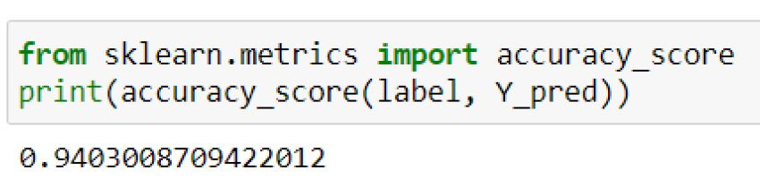
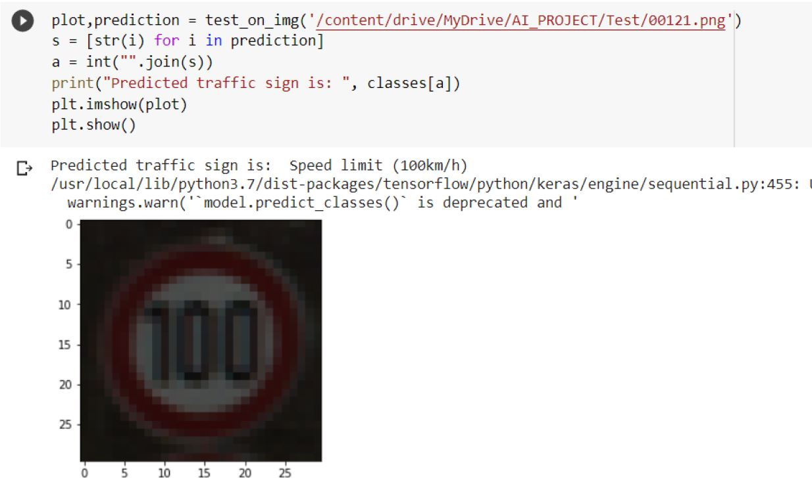

# Traffic_Sign_Predictor

Model is mostly based on convolutional neural networks so after every 2
convolutional networks I have passed a max pooling layer and also followed by a
dropout layer so that overfitting can be removed , so when conventional layers have
extracted the information I am flattening the image so that now I can convert it
to single layer and send it to dense layer.

# How to Make it work.

Code=https://colab.research.google.com/drive/1Tzk9is9O5h5veiJibj5ckSRkf09rKIux?usp=sharing 
I have uploaded the already trained model above in training folder. 

Make sure to change path to the place where you have downloaded the model(if you are downloading the model and not training it.) 

Dataset used:German Traffic Sign BenchMark : ("https://www.kaggle.com/meowmeowmeowmeowmeow/gtsrb-german-traffic-sign")

# Sample Picture:

# Got Accuracy of = 94%
